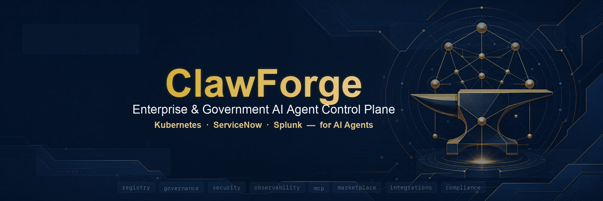
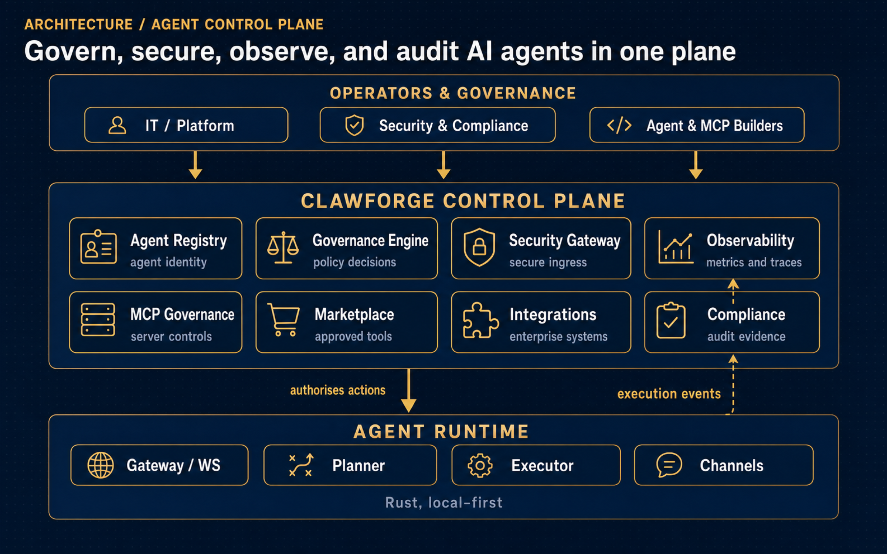

<p align="center">
  
</p>

<h1 align="center">ClawForge</h1>

<p align="center">
  <strong>The control plane for governing, securing, observing, auditing, and operating AI agents and MCP servers.</strong>
</p>

<p align="center">
  <a href="LICENSE"></a>
  
  
  
</p>

<p align="center">
  <em>Kubernetes&nbsp;·&nbsp;ServiceNow&nbsp;·&nbsp;Splunk&nbsp;—&nbsp;for AI Agents.</em>
</p>

---

## Overview

**ClawForge is not another agent framework.** It is the **control plane** for
managing, governing, securing, observing, auditing, and operating AI agents, MCP
servers, workflows, tools, models, and enterprise integrations — built for
government entities, municipalities, and enterprise IT, security, and AI platform
teams.

| Product | Role |
|---------|------|
| **Hermes** | Learns |
| **OpenClaw** | Executes |
| **Paperclip** | AI company OS |
| **ClawForge** | **Enterprise / Government Agent Control Plane** |

Beneath the control plane sits a high-performance, local-first **agent runtime**
written entirely in Rust — a Rust implementation of the
[OpenClaw](https://openclaw.ai) topology that orchestrates autonomous agents over
a central WebSocket gateway, across channels (WhatsApp, Telegram, Discord, Slack),
with tools, sandboxing, and memory. The `clawforge-controlplane` crate wraps that
runtime with the registry, governance, security, observability, and compliance
layers an organisation needs to run agents safely at scale.

> ClawForge is an enterprise-grade AI agent control plane for governing, securing,
> monitoring, auditing, and operating AI agents and MCP servers across government
> and enterprise environments.

## Architecture

<p align="center">
  
</p>

Operators and governance teams drive the **control plane**; the control plane
authorises and governs the **agent runtime**; the runtime streams execution
events back for observability and audit. See
[docs/architecture.md](docs/architecture.md) and [docs/diagrams.md](docs/diagrams.md).

## Capabilities

The `clawforge-controlplane` crate adds the layers an organisation needs to run
agents safely at scale. Each is a self-contained, SQLite-backed, fully tested
domain module:

| Capability | What it does | Docs |
|------------|--------------|------|
| **Agent Registry** | Single source of truth for every agent (owner, tools, MCP, data access, risk, lifecycle) | [registry.md](docs/registry.md) |
| **Governance Engine** | Human approval workflow with department ownership, change history, and audit | [governance.md](docs/governance.md) |
| **Observability** | Execution events → task / cost / latency / failure / risk metrics, per-agent and fleet-wide | [observability.md](docs/observability.md) |
| **Security Gateway** | Pre-execution checks on every action (tool / MCP / model / data / budget / approval) + risk score | [security-gateway.md](docs/security-gateway.md) |
| **MCP Governance** | Registry, approval, health, and usage tracking for MCP servers | [mcp-governance.md](docs/mcp-governance.md) |
| **Agent Marketplace** | Verified, reusable internal agent templates with compliance badges | [marketplace.md](docs/marketplace.md) |
| **Enterprise Integrations** | Governed connectors (DBs, SSO, GIS, ITSM) — credentials referenced, never stored | [enterprise-integrations.md](docs/enterprise-integrations.md) |
| **Government Compliance** | PII classification, retention, approval chains, audit evidence, reporting (UAE PDPL-aware) | [government-compliance.md](docs/government-compliance.md) |

## Quick start

Requires **Rust ≥ 1.80** (and **Node ≥ 20** only for the web dashboard).

```bash
git clone https://github.com/YASSERRMD/clawforge.git
cd clawforge

# Build & test the control plane
cargo build -p clawforge-controlplane
cargo test  -p clawforge-controlplane          # 82 tests

# Run the end-to-end control-plane demo
cargo run -p clawforge-controlplane --example demo
```

The demo walks a single agent through the whole control plane — marketplace
install → MCP approval → governance → security gateway → observability →
compliance report — in memory. See [docs/demo.md](docs/demo.md).

### Running the full runtime (optional)

```bash
# Set a key for any provider(s) you want; the runtime registers each one present.
export ANTHROPIC_API_KEY="sk-ant-..."   # or OPENAI_API_KEY, DEEPSEEK_API_KEY, OPENROUTER_API_KEY, ...
cargo run -p clawforge-cli -- serve --port 3000      # local-first gateway

cd frontend && npm install && npm run dev            # dashboard (separate terminal)
# or: docker-compose up --build
```

ClawForge is multi-provider: OpenAI, Anthropic, Google Gemini, Mistral, xAI,
Groq, OpenRouter, local Ollama, and the major Chinese providers (DeepSeek, Qwen,
Zhipu GLM, Moonshot/Kimi, Baidu ERNIE, MiniMax, Tencent Hunyuan, 01.AI Yi,
StepFun, Baichuan, iFlytek, SenseTime). See [docs/model-providers.md](docs/model-providers.md).

Configuration is environment-driven; see [.env.example](.env.example) and
[docs/installation.md](docs/installation.md).

## Documentation

- **Start here:** [Product positioning](docs/product-positioning.md) · [Architecture](docs/architecture.md) · [Diagrams](docs/diagrams.md) · [Installation](docs/installation.md) · [Model providers](docs/model-providers.md) · [Demo](docs/demo.md)
- **Use cases:** [Overview](docs/use-cases.md) · [Government municipality](docs/government-municipality.md) · [Enterprise IT](docs/enterprise.md)
- **Operations:** [UAE PDPL note](docs/uae-pdpl.md) · [Security disclaimer](docs/security-disclaimer.md) · [Roadmap](docs/roadmap.md) · [Limitations](docs/limitations.md)
- **Contributing:** [Developer guide](docs/developer-guide.md) · [CONTRIBUTING.md](CONTRIBUTING.md)

Full index: [docs/README.md](docs/README.md).

## The runtime underneath

ClawForge's control plane governs a complete, local-first agent runtime (Rust workspace):

- **`clawforge-core`** — central schemas (`AgentSpec`, `Message`, `Event`).
- **`clawforge-gateway` / `clawforge-daemon`** — Tokio WebSocket control plane for sessions, tools, and events.
- **`clawforge-planner` / `clawforge-executor`** — LLM provider integrations (OpenRouter, Ollama) and sandboxed action execution.
- **`clawforge-channels`** — deep adapters for Telegram, Discord, Slack, LINE, iMessage, and WhatsApp.
- **`clawforge-plugins` / `clawforge-browser` / `clawforge-understanding`** — WASM plugins, CDP browser automation, and OCR/STT/PDF media pipelines.
- **`clawforge-memory` / `clawforge-supervisor`** — vector memory for RAG and SQLite run-state persistence.

## Security

ClawForge connects to real messaging surfaces — treat inbound messages, tool
output, and MCP responses as **untrusted input**. The Security Gateway gates
*capabilities* (which tool / MCP / model / data an action may use); keep
untrusted execution sandboxed (the runtime supports Docker isolation). Secrets
are never stored — integrations hold credential *references* only. Read the full
[security disclaimer](docs/security-disclaimer.md) and [limitations](docs/limitations.md)
before relying on ClawForge.

## Contributing

Contributions are welcome. Please read the [developer guide](docs/developer-guide.md)
and [CONTRIBUTING.md](CONTRIBUTING.md) — work in atomic, well-described commits,
run `cargo test -p clawforge-controlplane` before opening a pull request, and keep
documentation in step with code.

## License

[MIT](LICENSE).
