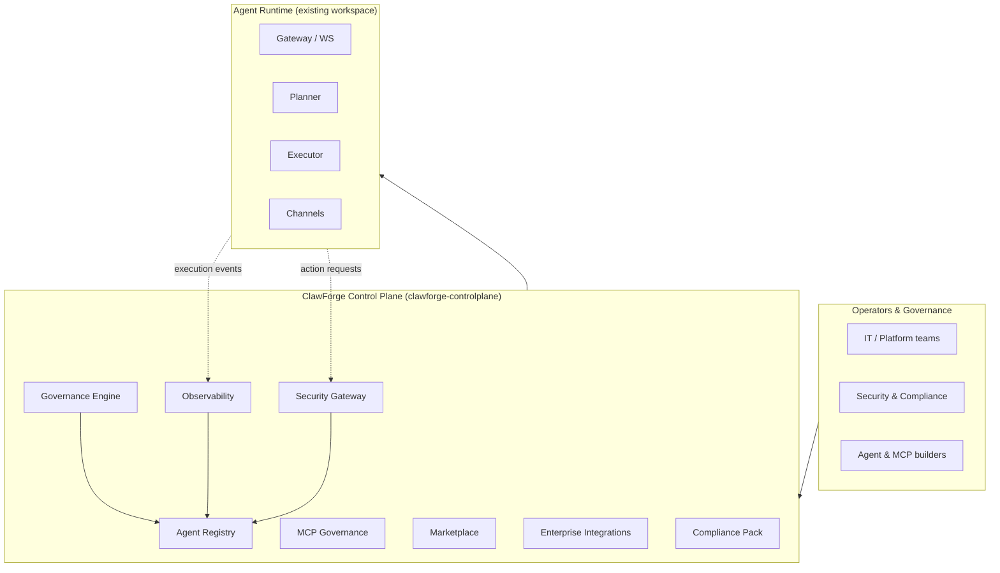

# ClawForge Architecture

ClawForge has two layers:

1. **Agent runtime** — the existing Rust workspace that *runs* agents (gateway,
   planner, executor, channels, tools, memory, …).
2. **Control plane** — the `clawforge-controlplane` crate that *governs* agents
   (registry, governance, observability, security gateway, MCP governance,
   marketplace, integrations, compliance).

This document describes the control plane and how it relates to the runtime.

## High-level picture



## Control-plane crate structure

```
backend/controlplane/
├── Cargo.toml
└── src/
    ├── lib.rs          # crate docs + module wiring
    ├── config.rs       # env-driven ControlPlaneConfig
    ├── constants.rs    # RiskLevel, DataAccessLevel, LifecycleStatus, product consts
    ├── error.rs        # ControlPlaneError + Result alias
    ├── logging.rs      # cp_info! / cp_warn! / cp_blocked! macros
    ├── registry/       # Phase 2 — Agent Registry
    ├── governance.rs   # Phase 3 — Governance Engine
    ├── observability/  # Phase 4 — metrics & execution events
    ├── gateway.rs      # Phase 5 — Security Gateway
    ├── mcp/            # Phase 6 — MCP registry & governance
    ├── marketplace.rs  # Phase 7 — verified agent templates
    ├── integrations/   # Phase 8 — enterprise integration registry
    └── compliance/     # Phase 9 — government compliance pack
```

(Modules land phase by phase; the table reflects the target shape.)

## Design principles

- **Local-first & embeddable.** The control plane is a library crate backed by
  SQLite, with `open(path)` for persistence and `in_memory()` for tests. It can
  be embedded in the CLI/daemon or exposed via the gateway.
- **One vocabulary.** Risk, data sensitivity, and lifecycle state are defined
  once in `constants.rs` and shared by every domain.
- **Everything is auditable.** Governance decisions, security denials, and
  execution events all produce records intended for the audit trail.
- **Framework-agnostic governance.** The registry stores *metadata* about agents
  (framework, model provider, allowed tools/MCP) without coupling to any single
  runtime, so ClawForge can govern heterogeneous fleets.

## Data flow: an action being checked

1. The runtime is about to perform an action (call a tool, hit an MCP server).
2. It asks the **Security Gateway** with an action request describing the agent,
   tool, MCP server, model, data access, and budget context.
3. The gateway consults the **Agent Registry** (is the agent active/approved?),
   **Governance** (is a human gate required?), and policy.
4. The gateway returns an allow/deny decision with a reason and risk score.
5. Allowed or blocked, the outcome is recorded for **Observability** and the
   **Compliance** audit trail.
