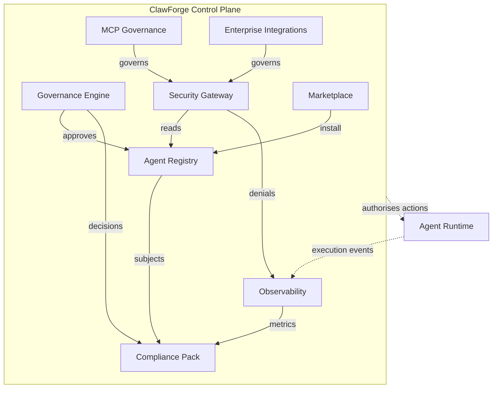
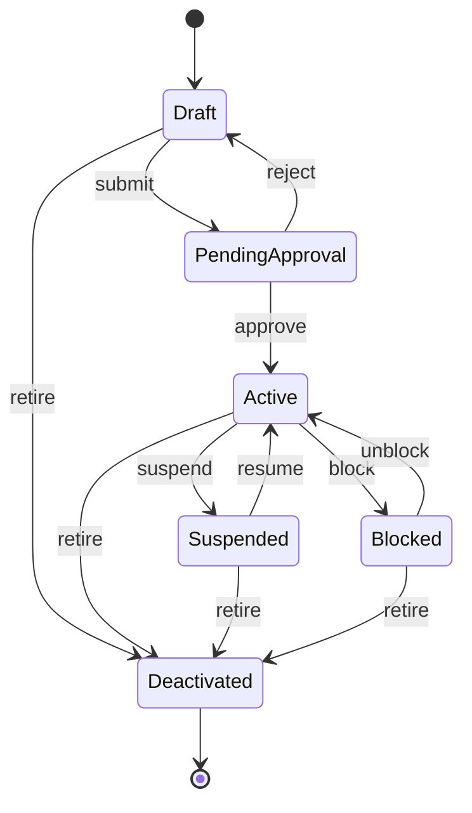
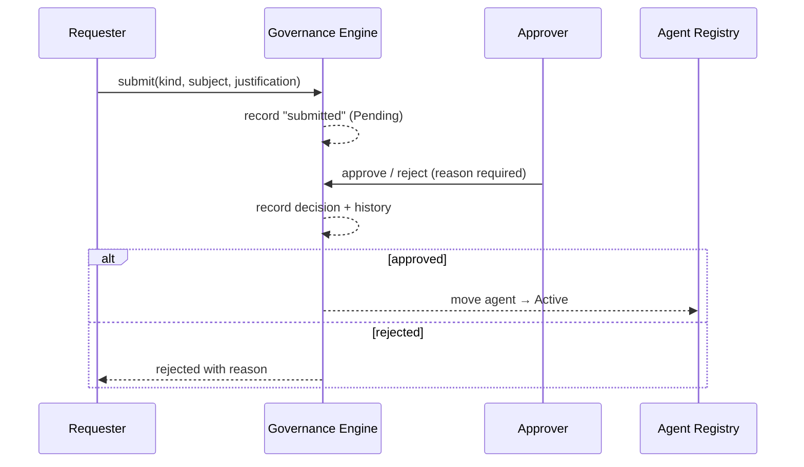

# ClawForge Diagrams

Mermaid diagrams for the control plane. (GitHub renders these inline.)

## Control-plane architecture

How the control-plane modules relate to each other and to the agent runtime.

## Agent lifecycle

The registry state machine. An agent can only become operational by passing
through approval — a direct `Draft → Active` jump is rejected.

## Governance approval workflow

