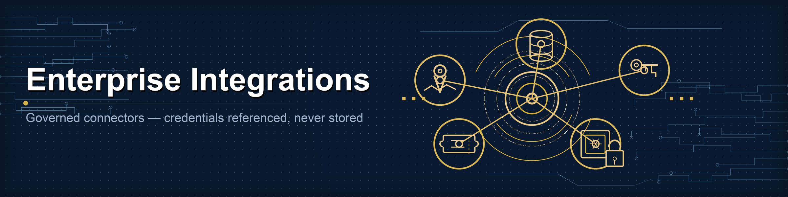

# Enterprise Integrations



ClawForge governs *connections* to enterprise and government systems. The
integration registry (`clawforge_controlplane::integrations`) tracks every
connector, who owns it, what it is allowed to do, where its credentials live,
and whether it is approved - **without ever storing a secret**.

## Categories (`IntegrationKind`)

Oracle, SQL Server, PostgreSQL, MongoDB, SharePoint, ServiceNow, ArcGIS,
Active Directory, SSO, API Gateway, Email, Webhook.

## Credentials are referenced, never stored

`CredentialRef` records *where* a secret lives (`vault` / `env` / `sso` /
`keychain` / `none`) and the lookup `key` - never the secret material itself.
This keeps the control plane out of scope for secret storage while still giving
governance a complete picture of what an integration can reach.

```rust
CredentialRef::vault("kv/integrations/resident-db");
CredentialRef::env("SMTP_PASSWORD");
CredentialRef::none(); // e.g. an unauthenticated webhook
```

## Permissions & risk

`IntegrationPermission` is `connect` / `read` / `write` / `delete` / `admin`.
Granting `write`, `delete`, or `admin` is *elevated*. `classify_risk(kind,
permissions)` computes effective risk: the higher of the category baseline
(identity stores and SSO are `critical`; primary databases are `high`) and a
`high` floor implied by any elevated permission. Registration escalates an
integration's risk to this baseline - it never silently downgrades an explicit
level.

## API

```rust
use clawforge_controlplane::integrations::{IntegrationRegistry, placeholders, CredentialRef};
use clawforge_controlplane::integrations::model::IntegrationKind;

let reg = IntegrationRegistry::open("clawforge-controlplane.db")?;

// Placeholder builders for common categories:
let db   = placeholders::database("Resident DB", "data", "IT", IntegrationKind::Postgres,
                                  "postgres://db/residents", CredentialRef::vault("kv/db"));
let sso  = placeholders::sso("Corp SSO", "iam", "IT", "https://idp/realm", CredentialRef::vault("kv/sso"));
let mail = placeholders::email("Notifier", "ops", "IT", "smtp://mail:587", CredentialRef::env("SMTP_PASSWORD"));
let gis  = placeholders::gis("City GIS", "gis", "Planning", "https://gis/arcgis", CredentialRef::none());
let hook = placeholders::webhook("Alerts", "ops", "IT", "https://hooks/x");

let integration = reg.register(db)?;     // starts pending_approval
reg.approve(&integration.id)?;           // make usable
// reg.block(&integration.id)? to take it out of service

let trail = reg.audit_log(&integration.id)?; // registered → approved → blocked
```

## Audit

Every register / approve / block appends an `IntegrationAuditEvent`, giving a
complete, ordered trail per integration for compliance evidence.

## Status

These are governance and connection *blueprints*. The actual wire protocol for
each system is implemented by the runtime; the control plane's job is to decide
which integrations exist, classify their risk, and keep them auditable.
