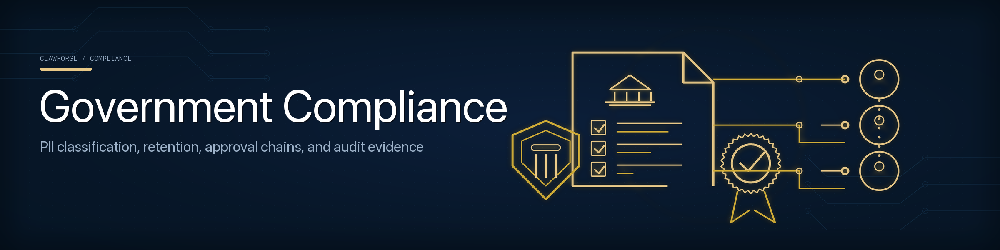

# Government Compliance Pack



The compliance pack (`clawforge_controlplane::compliance`) gives government and
regulated deployments the controls and evidence to operate agents responsibly:
PII classification, retention, multi-party approval, audit evidence,
investigation holds, export control, and reporting. It is framework-aware (UAE
PDPL by default) without hard-coding any single jurisdiction. See
[uae-pdpl.md](uae-pdpl.md).

## Compliance policy

`CompliancePolicy` governs a subject (an agent id or a department):

| Field | Meaning |
|-------|---------|
| `framework` | e.g. `UAE-PDPL` |
| `pii_classification` | `non_pii` / `pii` / `sensitive_pii` |
| `data_retention_days` | retention window; `0` = indefinite |
| `investigation_mode` | legal hold — suspends deletion, mandates evidence |
| `export_control` | `unrestricted` / `restricted` / `prohibited` |

`is_past_retention(age_days)` honours both indefinite retention and an active
investigation hold (a hold overrides routine deletion).

## Approval chains

`ApprovalChain::from_roles(subject, &["data-owner", "dpo", "ciso"])` builds an
ordered, multi-party sign-off. `approve_next(approver, at)` advances it one step
at a time; `is_complete()` reports when every role has signed.

## Audit evidence

`AuditEvidence` is a tamper-evident record with a `content_hash` and a
`signature` placeholder (`is_signed()`), ready for a future digital-signature
implementation. Investigations and sensitive-PII processing are expected to
produce signed evidence.

## Reporting

```rust
use clawforge_controlplane::compliance::{CompliancePolicy, PiiClassification, ApprovalChain, ComplianceReport, DepartmentComplianceSummary};

let mut policy = CompliancePolicy::pdpl("agent-1");
policy.pii_classification = PiiClassification::SensitivePii;
policy.data_retention_days = 365;

let chain = ApprovalChain::from_roles("agent-1", &["data-owner", "dpo"]);

// Per-subject report (pure function of policy + evidence + chain)
let report = ComplianceReport::generate(&policy, &evidence, Some(&chain));
if !report.is_compliant() {
    for finding in &report.findings { println!("⚠ {finding}"); }
}

// Department roll-up
let summary = DepartmentComplianceSummary::summarize("Licensing", &reports);
println!("compliance rate: {:.0}%", summary.compliance_rate() * 100.0);
```

`ComplianceReport::generate` flags: regulated PII without evidence, sensitive
PII without a completed approval chain, regulated PII with no retention period,
incomplete approval chains, and export-prohibited data lacking signed evidence.

## Design

Reports are **pure functions** of data assembled from the other control-plane
stores (registry, governance, gateway, integrations). Nothing is recomputed
from a separate source of truth, so a report is always reproducible from the
evidence on file — exactly what an auditor or investigator needs.
