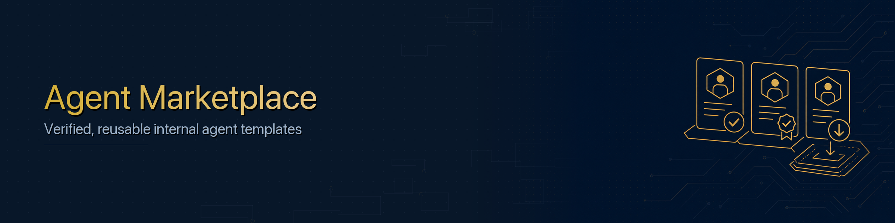

# Agent Marketplace



The marketplace (`clawforge_controlplane::marketplace`) is a **verified, internal
catalogue of reusable agent templates**. Teams publish proven agent blueprints;
other teams install them as governed, registry-tracked agents - without
re-engineering or re-reviewing from scratch.

## Listings

A `MarketplaceAgent` listing carries identity (`name`, `description`,
`category`, `department`), social proof (`rating`, `install_count`), a
`risk_level`, two badges, and an `AgentTemplate` blueprint.

### Badges

| Badge | Values | Awarded by |
|-------|--------|-----------|
| `verification` | `unverified` → `verified` | platform team |
| `compliance` | `pending` → `compliant` → `certified` | compliance team |

`is_trusted()` is true only when a listing is **verified** *and* at least
**compliant** - the bar for surfacing it as install-ready.

## Templates

An `AgentTemplate` is everything needed to instantiate a concrete agent:
`framework`, default `model_provider`/`model_name`, `required_tools`,
`required_mcp_servers`, `required_model_providers`, `data_access_level`, and
`risk_level`. `to_new_agent(...)` turns it into a registry `NewAgent`.

## API

```rust
use clawforge_controlplane::marketplace::{Marketplace, NewListing, AgentTemplate, VerificationBadge, ComplianceBadge};
use clawforge_controlplane::registry::AgentRegistry;
use clawforge_controlplane::constants::RiskLevel;

let mkt = Marketplace::open("clawforge-controlplane.db")?;
let reg = AgentRegistry::open("clawforge-controlplane.db")?;

// Publish (starts unverified + pending)
let listing = mkt.publish(NewListing { /* … template … */ })?;

// Vet it
mkt.set_verification(&listing.id, VerificationBadge::Verified)?;
mkt.set_compliance(&listing.id, ComplianceBadge::Compliant)?;

// Browse
let all       = mkt.list()?;                              // most-installed first
let licensing = mkt.list_by_category("licensing")?;
let low_risk  = mkt.list_by_risk(RiskLevel::Low)?;

// Install into the registry (creates a Draft agent, bumps install_count)
let agent = mkt.install(&listing.id, &reg, "Permit Bot A", "team-a", "Licensing")?;
```

## How it ties together

`install` is the bridge to the **Agent Registry**: it stamps out a `Draft`
agent from the template, which then flows through the normal governance and
security lifecycle. The marketplace itself stays decoupled from agent
persistence - it is handed the registry to install into.

## Seed data

`marketplace::seed::seed(&mkt)` publishes two verified, compliant sample
listings (permit intake, service-desk responder) for demos.
