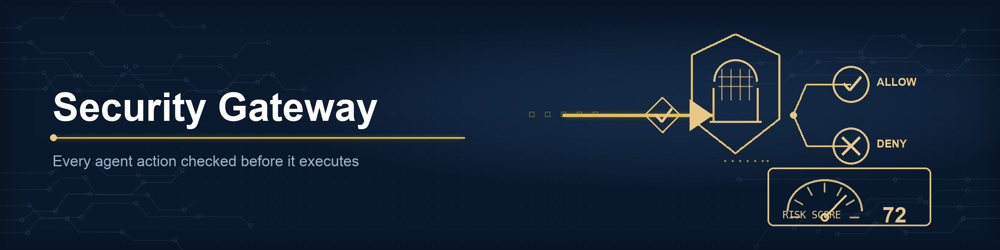

# Security Gateway



The Security Gateway (`clawforge_controlplane::gateway`) is the enforcement
point: **every agent action is checked before execution**. It is deny-by-reason:
an action is allowed only if no check objects.

## Inputs

- **`SecurityPolicy`** - the capabilities and limits in force: human-approval
  requirement, external network / file export / database write / PII toggles, a
  data-sensitivity ceiling, and a budget limit. `SecurityPolicy::default()` is a
  conservative government-grade posture; `::permissive()` suits trusted internal
  automation.
- **`ActionRequest`** - the agent's current registry record plus the specifics
  of the attempted action (tool, MCP server, model, data sensitivity, estimated
  cost, spend so far, and capability flags).

## Checks performed

| Check | Denies when … |
|-------|---------------|
| Agent state | agent is not `Active` (draft / blocked / deactivated) |
| Tool | tool is not on the agent's allow-list |
| MCP | MCP server is not on the agent's allow-list |
| Model | model differs from the agent's approved model |
| Data access | sensitivity exceeds agent clearance or policy ceiling |
| Capabilities | external network / file export / db write / PII not permitted |
| Budget | projected spend exceeds the budget limit |
| Human approval | high/critical-risk action under a mandated approval gate |

## Output

`SecurityDecision { allowed, denials, risk_score, evaluated_at }`. All failing
reasons are collected (not just the first), so an operator sees everything wrong
at once. Helpers: `primary_reason()`, `risk_band()` (low/medium/high/critical),
and `summary()` for a one-line verdict.

The **risk score** (0–100) combines the agent's inherent risk, the data
sensitivity touched, sensitive capabilities requested, and the number of failing
checks.

## Example

```rust
use clawforge_controlplane::gateway::{SecurityGateway, SecurityPolicy, ActionRequest, BlockedExecutionLog};
use clawforge_controlplane::constants::DataAccessLevel;

let gw  = SecurityGateway::new(SecurityPolicy::default());
let log = BlockedExecutionLog::open("clawforge-controlplane.db")?;

let mut req = ActionRequest::for_agent(agent_record);
req.tool = Some("search".into());
req.data_access_level = DataAccessLevel::Internal;
req.estimated_cost = 0.02;

let decision = gw.evaluate(&req);
log.record(&req.agent.id, &decision)?; // no-op if allowed

if decision.allowed {
    // proceed with execution
} else {
    eprintln!("{}", decision.summary());
}
```

## Blocked execution log

Denied attempts are persisted to `BlockedExecutionLog` (append-only SQLite),
feeding the audit trail and the observability `blocked_executions` metric. The
`record` call is a no-op for allowed decisions, so callers can pass every
decision unconditionally.

## Relationship to the rest of the control plane

The gateway is intentionally **stateless** about other stores: the
`ActionRequest` carries the agent record, so evaluation is pure and trivially
testable. Governance decides *whether an agent should exist*; the gateway
decides *whether a specific action may run right now*.
