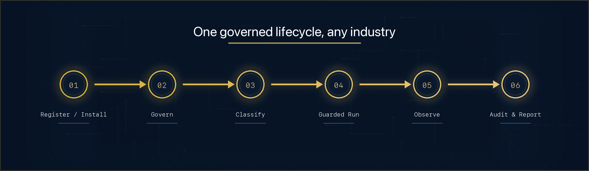

# Use Cases



How the control-plane modules combine into end-to-end workflows.

## The general flow

Every ClawForge deployment follows the same governed lifecycle, regardless of
industry:

1. **Publish or register** — a team registers an agent (or installs a verified
   one from the **Marketplace**), landing it in the **Registry** as `Draft`.
2. **Govern** — the agent is submitted to the **Governance Engine**; an approver
   signs off with a recorded reason. On approval it moves to `Active`.
3. **Classify** — a **Compliance Policy** sets the agent's PII classification,
   retention, export control, and (for sensitive data) an approval chain.
4. **Run under guard** — at execution time the **Security Gateway** checks each
   action (tool/MCP/model/data/budget/approval) and emits an allow/deny decision
   with a risk score; denials are logged.
5. **Observe** — every action emits **Observability** events feeding per-agent
   and fleet dashboards.
6. **Audit & report** — governance history, blocked-execution logs, integration
   audit trails, and signed **Audit Evidence** roll up into **Compliance
   Reports**.

```rust
// Sketch — see each module's doc for the full API.
let agent = marketplace.install(&listing.id, &registry, "Permit Bot", "team-a", "Licensing")?;
let req   = governance.submit(/* approval request for agent */)?;
governance.approve(&req.id, "ciso", "meets data-access policy")?;
registry.set_status(&agent.id, LifecycleStatus::PendingApproval)?;
registry.set_status(&agent.id, LifecycleStatus::Active)?;

let decision = gateway.evaluate(&action_request);   // checked before every action
observability.log_event(NewExecutionEvent::task(&agent.id, decision.allowed, 120, 0.02))?;
let report = ComplianceReport::generate(&policy, &evidence, Some(&chain));
```

See [government-municipality.md](government-municipality.md) and
[enterprise.md](enterprise.md) for concrete, worked scenarios.
